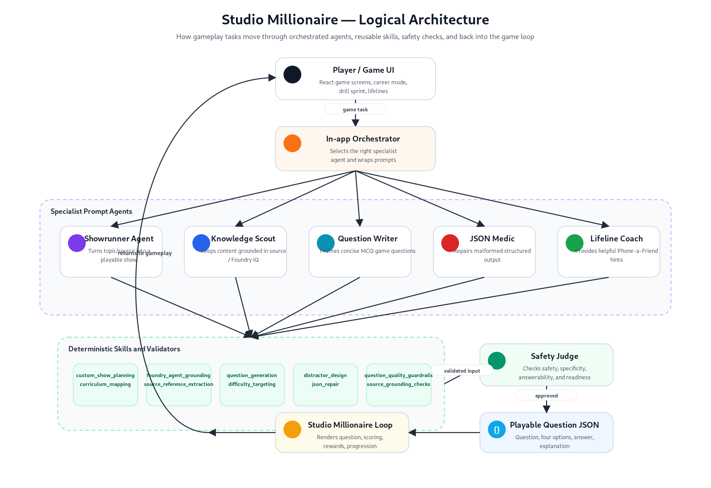
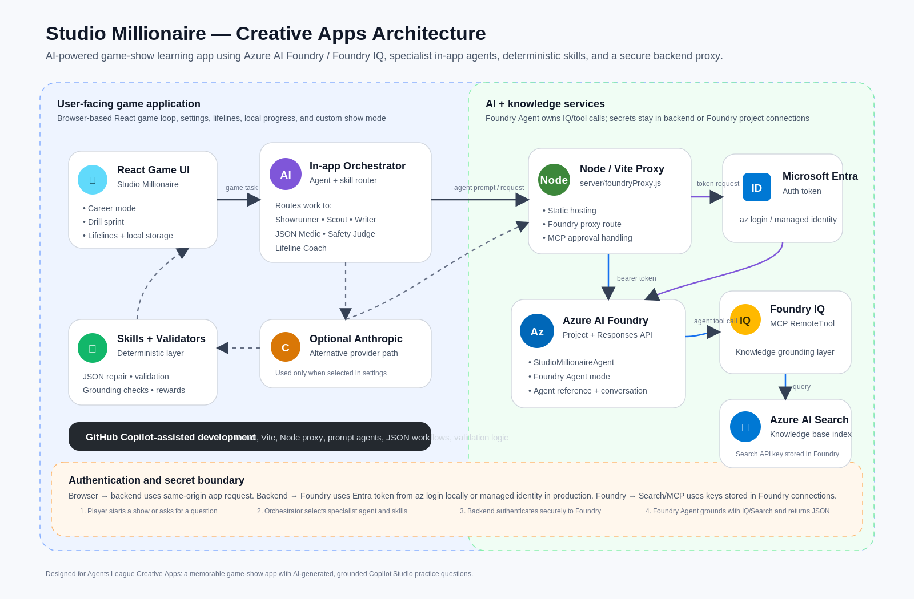

# 🎮 Studio Millionaire Game

🚀 [Live App](https://wwbcm.azurewebsites.net/) and 🎥 [Demo Video](https://drive.google.com/file/d/1CwdQdNJfxrptBDozMuv-ob3uob36Y8Gr/view?usp=sharing)


### Learn Anything Through AI Game Shows

> Transform knowledge into engaging game-show experiences using Azure AI Foundry, Foundry IQ, and AI-powered question generation.

## 🏆 Agents League 2026 Submission

| Item         | Value                                         |
| ------------ | --------------------------------------------- |
| Category     | Creative Apps                                 |
| AI Platform  | Azure AI Foundry                              |
| IQ Layer     | Foundry IQ                                    |
| Architecture | Multi-Agent + Skills                          |
| Built With   | GitHub Copilot, React, Vite, Azure AI Foundry |

---

## 📖 Overview

Studio Millionaire Game is an AI-powered game show platform inspired by *Who Wants to Be a Millionaire?*

Instead of relying on static question banks, the platform dynamically generates grounded, validated, and replayable questions from knowledge sources, enabling users to learn through gameplay.

Players can:

* Climb a prize ladder
* Use lifelines
* Complete timed challenges
* Learn Microsoft Copilot Studio concepts
* Create custom game shows from their own content


---

## ✨ Key Features

### AI Question Generation

Generate fresh multiple-choice questions on demand.

### Foundry IQ Grounding

Questions are grounded in trusted knowledge sources using Azure AI Foundry and Foundry IQ.

### Career Mode

Progress through increasingly challenging stages.

### Drill Sprint

Fast-paced timed learning challenges.

### Lifelines

* 50/50
* Ask the Audience
* Phone a Friend

### Custom Shows

Generate a Studio Millionaire experience from:

* Any topic
* Documentation
* Training material
* Study notes
* Knowledge bases

---

## 🧠 Why It Matters

Traditional learning is passive.

Studio Millionaire Game turns learning into an interactive experience by combining:

* Knowledge retrieval
* AI question generation
* Validation
* Gameplay mechanics

The result is a reusable platform capable of transforming almost any knowledge source into a game-show experience.

---

## 🏗️ Logical Architecture




### Agents

| Agent                 | Responsibility                          |
| --------------------- | --------------------------------------- |
| Showrunner Agent      | Creates game plans and experiences      |
| Knowledge Scout Agent | Grounds content using Foundry knowledge |
| Question Writer Agent | Generates game-ready questions          |
| JSON Medic Agent      | Repairs malformed AI output             |
| Safety Judge Agent    | Validates question quality              |
| Lifeline Coach Agent  | Generates player hints                  |

### Skills

* Question Generation
* Difficulty Targeting
* Foundry Grounding
* JSON Repair
* Source Extraction
* Validation
* Hint Generation

---

## ☁️ Technical Architecture



### Core Components

* React Frontend
* Vite Development Server
* Node Backend Proxy
* Microsoft Entra ID
* Azure AI Foundry
* Foundry IQ
* Grounded with real-time web content
* Optional Anthropic Integration

---

## 🔄 AI Workflow

1. Player requests a question.
2. Orchestrator selects the required agent flow.
3. Knowledge Scout retrieves grounded context.
4. Question Writer generates a question.
5. JSON Medic repairs malformed output if needed.
6. Safety Judge validates quality and structure.
7. Approved question is returned to gameplay.

---

## 🛡️ Security

* No secrets stored in source control.
* Browser never communicates directly with Azure services.
* Backend proxy handles authentication.
* Foundry manages knowledge source credentials.
* Managed Identity supported in production.

---

## 🚀 Running Locally

### Prerequisites

* Node.js
* Azure AI Foundry Project
* Azure OpenAI Deployment
* Azure CLI

### Install

```bash
npm install
```

### Configure

```bash
cp .env.example .env
```

Populate:

```env
AZURE_AI_PROJECT_ENDPOINT=
AZURE_OPENAI_ENDPOINT=
AZURE_OPENAI_API_KEY=
FOUNDRY_AGENT_NAME=
```

### Authenticate

```bash
az login
```

### Run

```bash
npm run dev
```

---

## 🎥 Demo

1. Launch [Studio Millionaire](https://wwbcm.azurewebsites.net/).
2. Start Career Mode.
3. Generate a grounded Copilot Studio question.
4. Use a lifeline.
5. Complete a Drill Sprint challenge.
6. Create a Custom Show from your own topic.

---

## 🔮 Future Vision

Studio Millionaire AI is designed as a reusable learning platform capable of supporting:

* Corporate Training
* Product Enablement
* Compliance Learning
* Certification Preparation
* Academic Learning
* Community Education

---

## 📜 License

MIT License

---

Built for Agents League 2026 using Azure AI Foundry and Foundry IQ.
